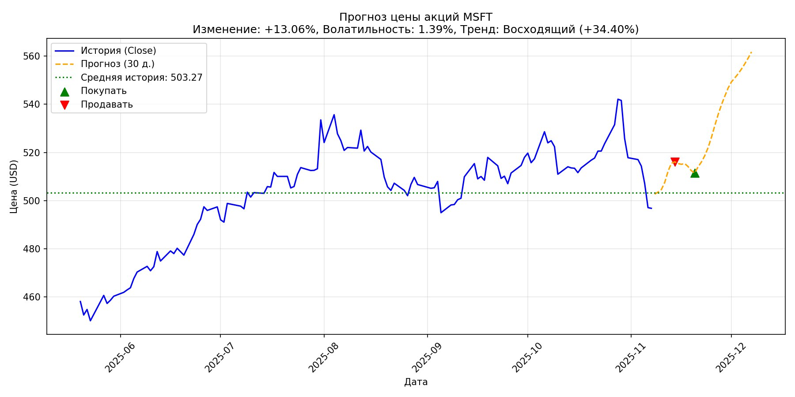

# Stock Prediction Telegram Bot

## Описание

Этот репозиторий содержит Telegram-бота для анализа и прогнозирования котировок акций по тикерам. Бот загружает исторические данные о ценах акций, обучает несколько моделей машинного обучения, генерирует прогноз на 30 дней и предоставляет рекомендации по торговле. Все результаты отображаются в виде графика и текстового отчета.

### Важное предупреждение:

**Бот предназначен исключительно в образовательных целях**. Прогнозы основаны на простых моделях и не являются финансовыми рекомендациями. Торговля акциями сопряжена с рисками. **Не используйте результаты для реальных инвестиций без консультации с профессионалом**.

---

## Функции

- **Загрузка данных:** Автоматическая загрузка котировок за последние 2 года с использованием библиотеки `yfinance` (колонка *Close*).
- **Обучение моделей:**
  - Ridge Regression с лагами и скользящими средними.
  - ARIMA(1,1,1) для базового временного ряда.
  - LSTM (нейронная сеть) на базе TensorFlow (пропускается, если TensorFlow недоступен).
- **Сравнение моделей:** Выбор лучшей модели по метрикам *RMSE* и *MAPE* на тестовом наборе (последние 30 дней).
- **Прогноз:** Генерация прогноза на 30 дней вперед с графиком (история + прогноз).
- **Анализ:**
  - Обнаружение локальных минимумов и максимумов в прогнозе для рекомендаций по покупке/продаже.
  - Оценка условной прибыли от простой торговой стратегии на введенную сумму.
  - Расчет волатильности и тренда на исторических данных.
- **Логирование:** Все запросы пользователей сохраняются в файл `logs.csv` (включая тикер, модель, метрики и оценку прибыли).
- **Интерфейс:** Поддержка ввода тикера и суммы в текстовом сообщении (пример: `GOOGL 20000`), инлайн-клавиатура с популярными тикерами.

---

## Файлы в репозитории

- **app.py**: Основной скрипт бота. Запускает Telegram-бот с использованием `aiogram`.
- **.env**: Файл с переменными окружения (содержит `TOKEN` для Telegram-бота). Не коммите в Git!
- **requirements.txt**: Список зависимостей для установки библиотек.
- **logs.csv**: (Автоматически создается) Лог всех взаимодействий с ботом.

---

## Установка и запуск

### Требования

- Python 3.8+.
- Доступ к интернету для загрузки котировок.
- Telegram Bot Token: создайте бота через @BotFather и получите токен.

### Шаги установки

1. Клонируйте репозиторий:
   ```bash
   git clone https://github.com/yourusername/stock-prediction-bot.git
   cd stock-prediction-bot
   ```

2. Установите зависимости:
   ```bash
   pip install -r requirements.txt
   ```

   Основные зависимости:
   - `aiogram` — для Telegram-бота.
   - `yfinance` — для загрузки котировок.
   - `numpy`, `pandas` — обработка данных.
   - `scikit-learn` — Ridge Regression.
   - `statsmodels` — ARIMA.
   - `matplotlib` — графики.
   - `tensorflow` — LSTM (опционально; если не установлен, LSTM пропускается).

   Если TensorFlow вызывает проблемы (например, на CPU без GPU), установите его отдельно:
   ```bash
   pip install tensorflow-cpu
   ```

3. Настройте переменные окружения:
   - Создайте файл `.env` в корне репозитория и добавьте токен:
     ```bash
     TOKEN=your_actual_bot_token
     ```
   - Бот автоматически загрузит его при запуске.

4. Запустите бота:
   ```bash
   python app.py
   ```

   Бот начнет polling и будет готов к работе. Для запуска в production используйте webhook или supervisor (например, systemd или Docker).

---

## Возможные проблемы

- **yfinance не работает:** Проверьте интернет-соединение. Библиотека имеет fallback на pandas_datareader, но если оба падают, укажите валидный тикер (см. список ниже).
- **TensorFlow недоступен:** LSTM будет пропущен; бот продолжит работу с Ridge и ARIMA.
- **Пропуски в данных:** Если данных меньше 80 дней, бот сообщит об ошибке.
- **Логи:** Файл `logs.csv` создастся автоматически. Структура: timestamp, user_id, ticker, amount, best_model, rmse, mape, delta_pct, profit_est.

---

## Использование

1. Запустите бота и напишите `/start` в чате.
2. Выберите вариант:
   - Введите текст: ТИКЕР СУММА (пример: `GOOGL 20000` — тикер Apple, сумма 10 000 USD).
   - Используйте инлайн-клавиатуру для популярных тикеров (`AAPL`, `MSFT`, `TSLA` и т.д.).
   - Кнопка "Показать список всех тикеров" для полного списка.

### Популярные тикеры (из кода):

- AAPL, MSFT, GOOGL, TSLA, AMZN, NVDA, META, NFLX, BABA, TSM
- V, JPM, WMT, DIS, KO, ORCL, CRM, AMD, INTC, IBM

### Ответ бота:



Лучший алгоритм: RIDGE

RMSE: 3.9905, MAPE: 0.64%

Текущая цена: 496.82 USD

Волатильность (год): 1.39%

Тренд (год): Восходящий (+34.40%)

Прогноз на 30 дней: изменение к последнему дню: +13.06%

Сигналы для покупок/продаж по локальным экстремумам не выражены.

Ориентировочная прибыль от стратегии на сумму 15000.00: 0.00 у.е.

⚠️ Результаты носят учебный характер и не являются инвестсоветом.

---
## Модели и алгоритмы
- Ridge Regression: Линейная модель с регуляризацией. Фичи: лаги (1–10 дней) + скользящие средние (3, 7, 14 дней). Разбиение: train/test (70/30 по времени).
- ARIMA(1,1,1): Классическая модель для временных рядов. Дифференцирование для стационарности.
- LSTM: Рекуррентная нейронная сеть (1 слой LSTM 32 + Dense). Нормализация Min-Max, окно 20 дней. Обучение 20 эпох.- Выбор модели: По среднему рангу RMSE и MAPE.
- Стратегия: Покупка на локальных минимумах прогноза, продажа на максимумах. Симуляция без комиссий.Прогноз на 30 дней генерируется итеративно (каждый шаг использует предыдущие предсказания).
---
## Логирование
Все запросы логируются в logs.csv:
- Время запроса.
- ID пользователя.
- Тикер и сумма.
- Лучшая модель и метрики.
- Изменение цены (%) и оценка прибыли.

Файл не коммите в Git, если содержит конфиденциальные данные.

---
## Разработка и вклад
- Код на Python: Полностью в app.py. Легко расширяем (добавьте модели в results).
- Вклад: Форки ручные, pull requests welcome. Улучшения: добавить больше моделей (Prophet, XGBoost), поддержку крипты, мульти-тикеры.- Лицензия: MIT (или укажите свою).
---
## Контакты
- Автор: Ваш dmshipov

Спасибо за интерес! 🚀